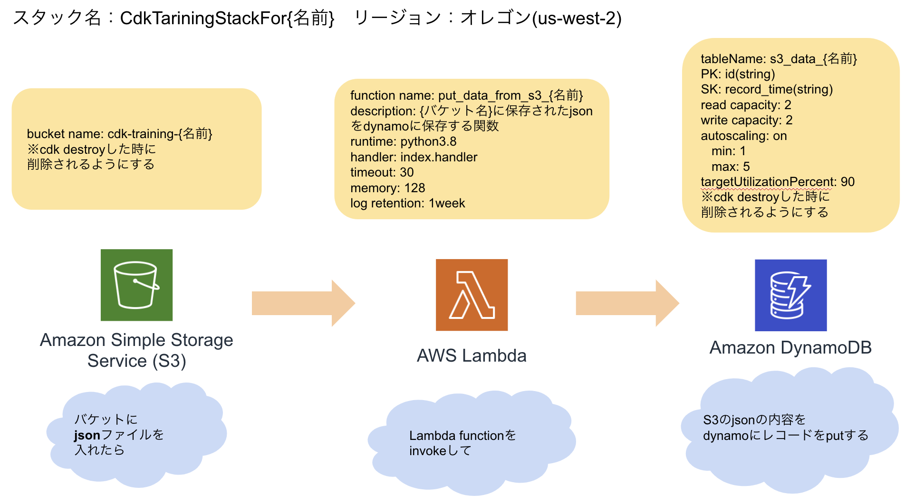

## 本リポジトリの概要

AWS cdkで環境を構築する際のサンプルコード

### 各ブランチについて

#### master

cdkを実装するのに必要最低限のファイルを揃えたブランチ

#### answer

以下のアーキテクチャを構築する際に使用するコード

## デプロイ方法

- `yarn cdk deploy スタック名 --profile プロファイル名`

## 削除方法

- `yarn cdk destroy スタック名 --profile プロファイル名`